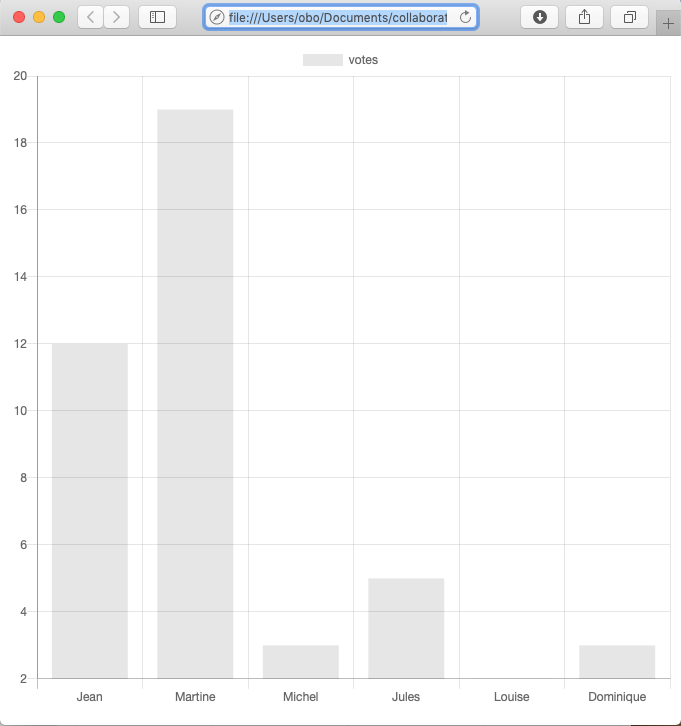
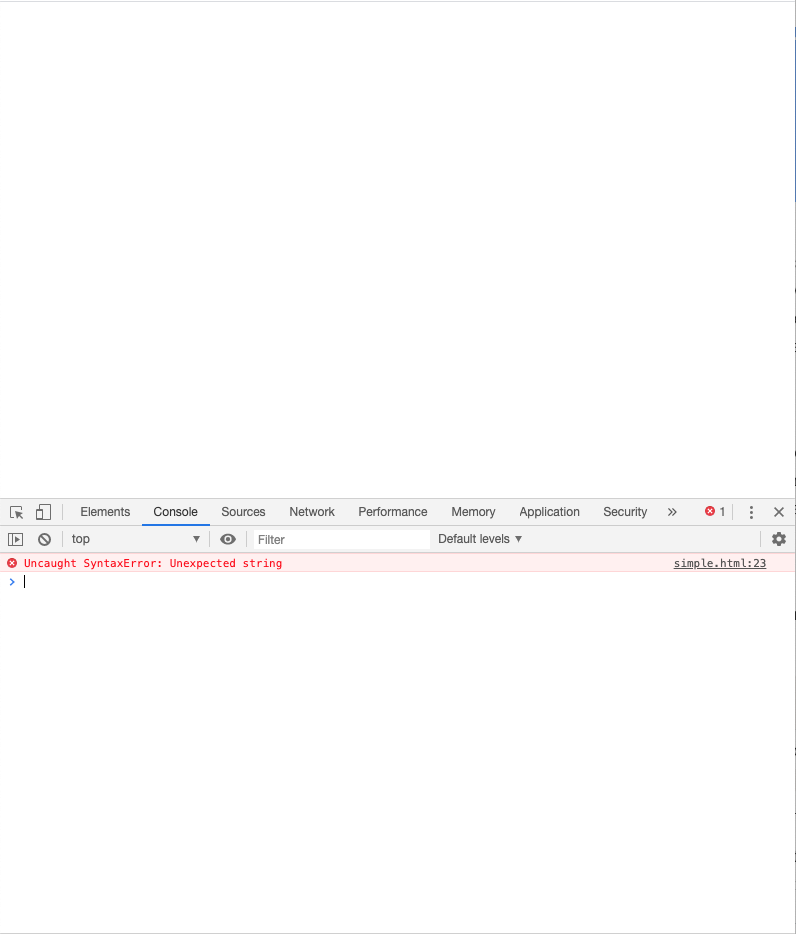
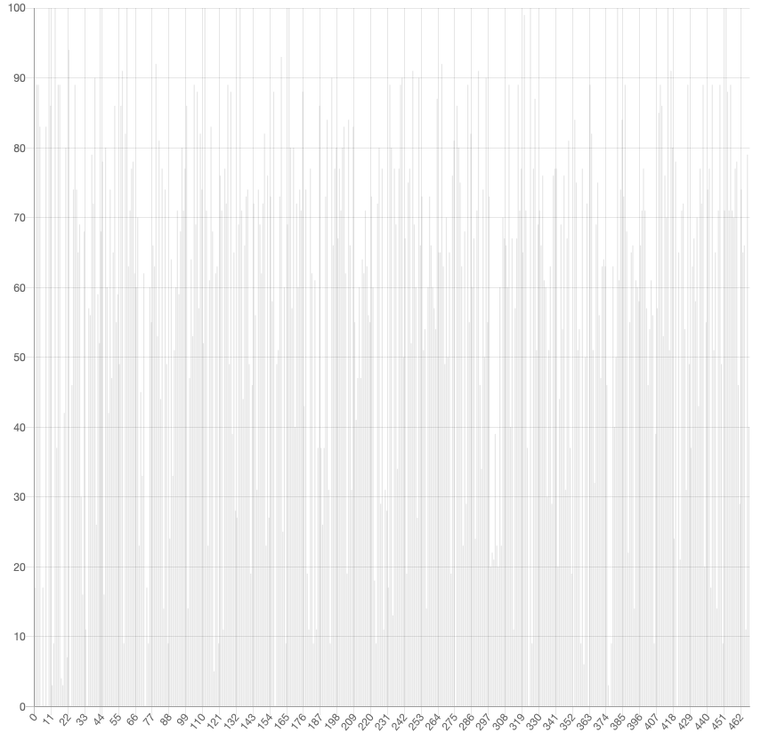
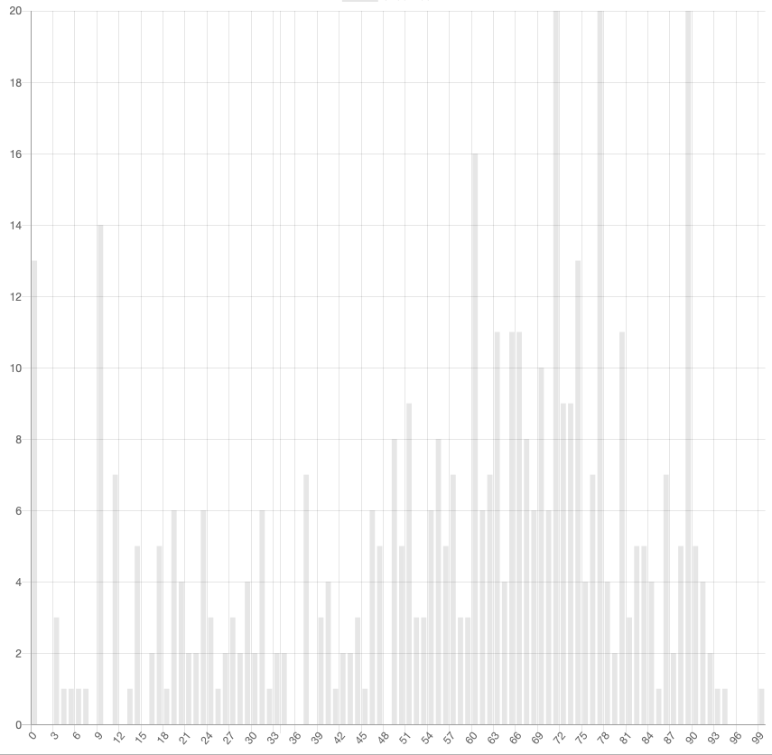
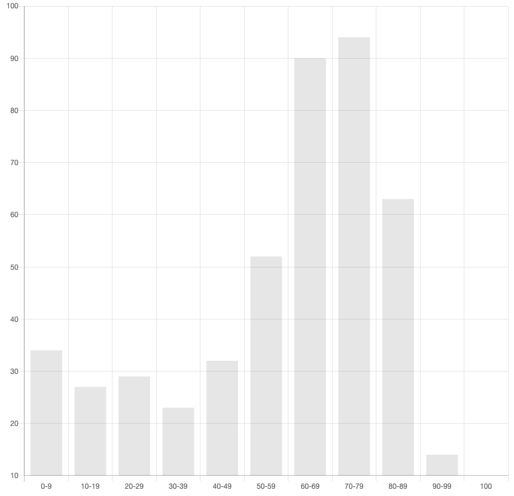
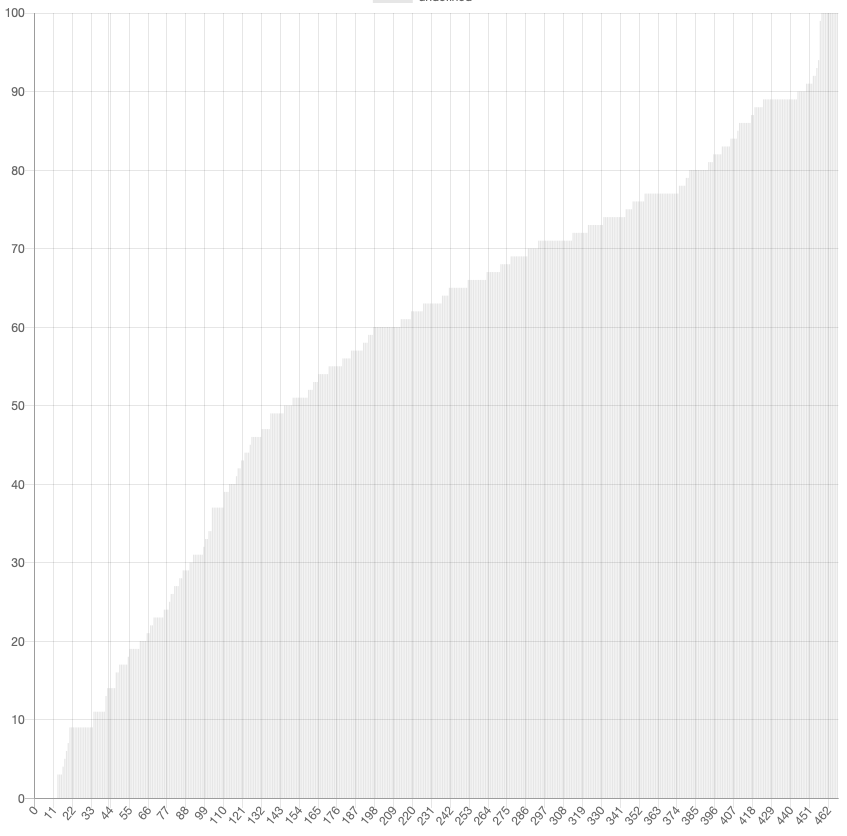

.. LINFO1002 documentation master file, created by
   sphinx-quickstart on Tue Jan 28 18:06:33 2020.
   You can adapt this file completely to your liking, but it should at least
   contain the root `toctree` directive.

.. _ref-chartjs:
   
La visualisation via ``chart.js``
=================================

Lorsque l'on est fasse à de grandes quantités d'informations, il est
important de pouvoir les visualiser correctement pour pouvoir
en tirer des conclusions. De nombreux logiciels permettent de visualiser
des données numériques sous différentes formes. Dans le cadre de
ce projet, votre objectif est de développer un site web interactif qui présente
des données de façon graphique. Une première approche pour construire
un tel site web pourrait être de produire ces graphiques directement
en python avec `matplotlib <https://matplotlib.org/>`_ par exemple et
d'intégrer les images produites dans des pages HTML. Une telle approche est
lourde à mettre en oeuvre. Il est préférable de passer par des librairies
spécialisées dans la visualisation d'information via le web.

Dans le cadre de ce projet, vous utiliserez `chartjs <https://www.chartjs.org>`_ qui est assez simple à mettre en oeuvre tout en donnant un excellent
résultat au niveau graphique. `chartjs <https://www.chartjs.org>`_ est une
librairie codée en Javascript. Javascript est un langage de programmation qui
est utilisé par les navigateurs pour avoir des pages HTML qui s'adaptent
dynamiquement. On peut voir Javascript comme étant une extension de HTML sur
le web. Dans le cadre de ce projet, nous nous concentrerons sur l'utilisation
de `chartjs <https://www.chartjs.org>`_ dans une page HTML. L'utilisation
complète de Javascript sort du cadre de ce cours.

Un graphique `chartjs` est toujours inclus dans une zone rectangular
définie par l'élément HTML5 `canvas` (canevas en français).
Celui-ci supporte plusieurs attributs dont
les plus importants sont :

 - `id` qui permet de donner un nom unique au canevas
 - `width` qui permet de spécifier la largeur du canevas
 - `height` qui permet de spécifier la hauteur du canevas

L'exemple ci-dessous illustre la déclaration d'un tel canevas. L'identifiant
permet de faire référence à ce canevas dans une feuille de style, mais surtout
dans le code Javascript qui utilise la librarie `chartjs`.
   

.. code-block:: html

                
   <canvas id="graphique" width="200" height="100"></canvas>

Vous pouvez maintenant facilement afficher un graphique en batonets dans une
page HTML. Pour cela, il faut d'abord charger la librairie `chartjs` dans
l'entête de votre page HTML en utilisant la balise ``. Il n'est pas nécessaire de
connaître Javascript pour pouvoir utiliser cette librairie. Il suffit de
consulter les nombreux exemples disponibles dans la `documentation de chartjs
<https://www.chartjs.org/docs/latest/>`_. La création d'un graphique
prend en général deux instructions Javascript. La première est la
ligne qui indique à Javascript d'associer à la variable `ctx`
le canevas dont l'identifiant est passé en argument à
la méthode `document.getElementById()`. Cette méthode permet de
récupérer dans la page HTML courante l'élément dont l'identifiant est fourni.
Toutes les
lignes en Javascript se terminent par le caractère `;` contrairement à
python. En Javascript, les caractères `//` marquent le début d'un commentaire.

.. code-block:: javascript

   var ctx = document.getElementById('graphique').getContext('2d');

La second ligne du script crée le graphique `new Chart(ctx, ...);` et
l'associe au canevas identifié par la variable `ctx` définie à la ligne précédente. Le deuxième argument spécifie le type du graphique `type: 'bar'`, les
données numériques à afficher (`data`) et les étiquettes à utiliser. Dans cet
exemple, nous affichons les votes reçus par six étudiants. Le code HTML complet
est repris ci-dessous ainsi que sa visualisation dans un navigateur.

   
.. literalinclude:: figures/chartjs/simple.html
   :language: html
              

   Exemple de diagramme en batonets avec chartjs

Lorsque l'on écrit ses premiers scripts en Javascript, on peut parfois faire
des erreurs de syntaxe difficiles à identifier et corriger. Heureusement,
les navigateurs modernes comprennent des outils qui facilitent la vie
des développeurs et leur permettent de corriger rapidement ces erreurs.
Prenons Chrome comme exemple, mais Firefox ou Safari supportent
les mêmes fonctionnalités. Ajoutons dans la page HTML ci-dessus une erreur
dans les étiquettes en oubliant la première apostrophe avant le prénom `Jean`.
Chrome n'affiche rien car il y a une erreur de syntaxe dans le javscript à
la ligne 23. 

   Erreur affichée dans la console de Chrome

En cliquant sur la ligne en erreur, Chrome affiche plus de détails qui en
facilitent sa correction.
   
.. figure:: figures/chartjs/chrome-err2.png 

   Plus d'informations sur l'erreur dans la console de Chrome

   
La librairie `chartjs` supporte de très nombreux types de graphes. Chaque type
de graphique supporte des dizaines d'options que vous pouvez combiner à
votre guise.

Lorsque l'on doit visualiser de grandes quantités de données, comme par exemple
les points à un examen, il peut être intéressant de regrouper ces données.
Prenons le fichier :download:`figures/chartjs/data.csv` qui contient les
résultats de 468 étudiants à une interrogation. Cet ensemble de données peut
être visualisé de nombreuses façons.

Une solution naive est de simplement afficher les points de chaque étudiant dans
l'ordre de leur numéro d'inscription. Le résultat est complètement illisible
et n'apporte aucune information utile.

   Une mauvaise visualisation des points des étudiants

Une deuxième approche est de regarder le nombre d'étudiants qui ont obtenu
chacune des cotes. Avec potentiellement 100 cotes différentes, cela rend
un graphique qui reste difficile à interpréter.

   Le nombre d'étudiants pour chaque cote 

Une meilleure approche est de regrouper les points obtenus par les étudiants
en classes, par exemple de 0-9, de 10 à 19, ... et de compter le nombre
d'étudiants dans chaque classe. Cela permet d'identifier

   Le nombre d'étudiants pour chaque classe

Une dernière approche est de trier les cotes de façon croissante. Cela permet
de facilement visualiser le nombre d'étudiants qui ont plus ou moins qu'une
certaine cote.

   Visualisation des cotes en ordre croissant

Les exemples ci-dessus sont illustratifs. Vous pouvez certainement faire
beaucoup mieux que ces exemple entièrement gris. Dans le cadre de ce projet, vous avez toute la liberté pour proposer une solution de visualisation qui permet
aux professeurs de visualiser les résultats des étudiants sur INGINIOUS. Vous
trouverez de très nombreux livres et références sur la visualisation de
données. Le livre `Fundamentals of Data Visualization <https://serialmentor.com/dataviz/index.html>`_ écrit par Claus Wilke fournit de très nombreuses astuces
et règles de bonne pratique. 
