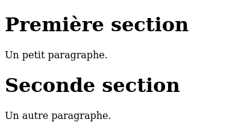
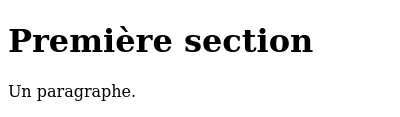
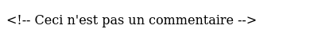
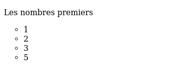
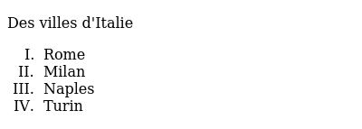
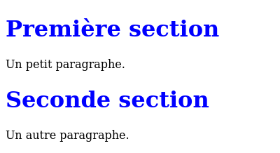
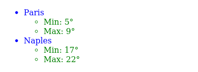
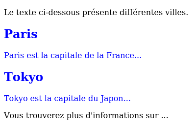
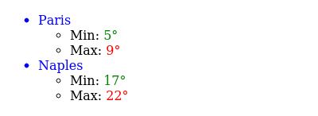

Le langage HTML
===============

L'HyperText Markup Language (HTML) est un langage de description de documents
qui s'appuie sur un ensemble de balises (`markups` en anglais). Il s'agit du
langage de référence pour décrire les pages web consultables via un navigateur.
Il existe de
nombreux livres et sites web qui fournissent de très nombreux détails sur HTML.
Les sites `https://www.w3schools.com/ <https://www.w3schools.com/html/>`_ et `https://developer.mozilla.org/en-US/docs/Web/HTML <https://developer.mozilla.org/en-US/docs/Web/HTML>`_ proposent
de nombreuses ressources concernant HTML et les technologies web.

Dans le cadre de ce projet, nous nous concentrerons sur un sous-ensemble de
la version 5 du langage HTML (HTML5). Libre à vous d'explorer le web et les
bibliothèques pour utiliser d'autres fonctionnalités de ce langage. Il est
très important pour un informaticien et pouvoir apprendre de façon autonome
en s'aidant des multiples ressources disponibles [#]_. 

.. [#] En cas de doute, la spécification officielle et complète de HTML5 est accessible en ligne:
       `https://html.spec.whatwg.org/multipage/ <https://html.spec.whatwg.org/multipage/>`_.

Un document HTML est composé de deux parties : l'entête (`head` en anglais) et le corps (`body` en anglais). L'entête contient des informations telles que le titre de la page qui sera affiché en haut de la fenêtre du navigateur, mais aussi le type de codage des caractères utilisé, ... Le corps de
la page contient lui le document en hypertexte.

Tout document HTML commence par la chaîne de caractères ``<!DOCTYPE html>``. Cette chaîne est suivie par la première balise (ouvrante) : `<html>`. Dans
l'exemple ci-dessous, tout le texte se trouvant entre la balise ouvrante, `<html>`, et la balise fermante, `</html>` est marqué comme étant en HTML. Si un document HTML contient la balise ouvrante `<xyz>` il doit y avoir une balise fermante `</xyz>` plus loin qui délimite la zone de texte couverte par cette balise. C'est un peu comme des parenthèses dans une expression mathématique. Il y a toujours une parenthèse fermante qui correspond à une parenthèse ouvrante. 

L'entête du document HTML ci-dessous est la zone du fichier se trouvant entre
les balises `<head>` et `</head>`. Celle-ci ne contient que le titre de la page que l'on reconnait grâce à l'utilisation de la balise `<title>`.

.. literalinclude:: figures/html/html-simple.html
   :language: html                 
               
   

   Une page HTML simple

   
Le corps du document HTML ci-dessus est la partie du fichier se trouvant entre
les balises `<body>` et `</body>`. Ce texte comprend deux sous-sections contenant chacune un paragraphe. La balise `<h1>` correspond à un titre de section de premier niveau (`<h2>` pour une sous-section, c'est-à-dire un titre de deuxième niveau, ...). La balise `
` sert à identifier un paragraphe.

HTML5 définit de nombreuses balises qui ne peuvent pas être toutes détaillées dans le cadre de cette brève introduction. Outre les balises telles que `<h1>`
qui définissent des niveaux de titre, il existe des balises qui permettent de
modifier le style utilisé pour présenter certains mots à l'écran, dont :

 - `<b>` qui est utilisé pour indiquer que du texte doit être écrit en gras. `<strong>` est un synonyme sur de nombreux navigateurs.
 - `<i>` qui est utilisé pour indiquer que du texte doit être écrit en italique. `<em>` est un synonyme sur de nombreux navigateurs.
 - `` qui indique que du texte doit être mis en indice
 - `` qui indique que du texte doit être mis en exposant
 - `<mark>` qui indique que du texte doit être surligné

Certaines balises sont liées à la présentation des paragraphes. Comme indiqué
précédemment, un paragraphe début toujours par `
` et se termine par `
`. Celui-ci peut contenir de nombreuses lignes de textes. Le navigateur se chargera
de mettre en forme le paragraphe correctement entre les balises `
` et `
`.
Parfois, l'auteur d'une page HTML peut souhaiter forcer un retour à la ligne à un endroit particulier d'un paragraphe. Cela peut se faire en utilisant
la balise ouvrante ` `. Cette balise force le navigateur à aller directement
à la ligne. C'est une des rares balises HTML à ne pas avoir de balise fermante.

Dans certains cas, notamment pour présenter du code dans un langage de programmation à l'intérieur d'une page HTML, il est préférable que le navigateur
présente le texte tel qu'il a été écrit dans le fichier et sans rajouter
d'espaces ou de retours à la ligne. Cela se fait en utilisant les
balises `<pre>` et `</pre>`. Le texte se trouvant entre ces deux balises
sera alors affiché tel quel en utilisant une police avec espacement fixe entre
les caractères alors que la police standard est généralement avec espacement
proportionnel.

Lorsque l'on écrit des pages HTML dans un éditeur de textes, il est parfois
utile d'ajouter des commentaires. Par convention, dans un document HTML, un
commentaire s'écrit à l'intérieur d'une balise `<!-- ... -->`. Il faut noter
que la fin du commentaire ne comprend pas de caractère `\` contrairement
aux balises fermantes habituelles. Un commentaire peut être placé sur
une ligne ou couvrir plusieurs lignes, comme les commentaires dans les
langages de programmation.

.. literalinclude:: figures/html/html-comment.html
   :language: html                 
               
   

   Une page HTML simple avec des commentaires

Comme le langage HTML utilise les caractères `<` et `>` dans la définition
des balises, comment faut-il afficher ces caractères dans un document
HTML ? Il n'est pas possible de simplement utiliser ces caractères
puisqu'ils sont interprétés par HTML comme des débuts de balises. Pour résoudre
ce problème, HTML définit les entités caractères suivantes:

 - `&lt;` pour représenter le caractère `<` dans du texte
 - `&gt;` pour représenter le caractère `>` dans du texte
 - `&amp;` pour représenter le caractère `&` dans du texte
 - `&nbsp;` pour indiquer un espace inséquable
 - `&quot;` pour le caractère correspondant aux guillemets (`"`)
 - `&apos;` pour le caractère correspondant à l'apostrophe

Ainsi, dans une page HTML, il est possible d'expliquer en HTML le format d'un
commentaire en HTML.

.. literalinclude:: figures/html/html-comment2.html
   :language: html                 
               
   

   Une autre page HTML montrant comment écrire un commentaire en HTML

De nombreuses balises HTML supportent des attributs qui permettent de
préciser certains paramètres de chacune d'entre elles. Il est impossible
de les lister toutes dans ce document. En voici quelques unes
qui pourraient être utiles dans le cadre de ce projet.

La balise `<html>` support l'attribut `lang` qui permet d'indiquer la langue
dans laquelle la page a été écrite. Ainsi `<html lang="fr">` est la balise
ouvrante d'un document écrit en français tandis que `<html lang="en">`
est celle d'un document en anglais.

La balise `<meta>` que l'on retrouve
dans l'entête d'un document HTML supporte différents attributs. Le plus important est le type de code
de caractères utilisé pour écrire le document. Aujourd'hui, le codage
le plus répandu est l'Unicode qui correspond à UTF-8. Parmi les autres
attributs, on peut citer :

 - l'attribut `description` qui fournit une information sur le contenu de la page
 - l'attribut `keywords` qui indique les mots-clés et peut être utile à des moteurs de recherche
 - l'attribut `author` qui indique l'auteur de la page

.. code-block:: html   

   <head>
     <meta charset="UTF-8">
     <meta name="description" content="Une première page web">
     <meta name="keywords" content="HTML,exemple">
     <meta name="author" content="Jean Tartempion">
   </head>

   

Ces attributs aux balises HTML nous permettent d'aborder deux éléments clés des
pages HTML :

 - les liens hypertextes
 - les images

En HTML, un lien hypertexte s'écrit en utilisant la balise `<a>...</a>` pour
ancre (`anchor` en anglais) et en utilisant l'attribut `href` pour indiquer
l'URL du lien hypertext. Ainsi dans un document HTML, un lien qui
pointe vers le site web de l'UCLouvain s'écrit comme suit :

.. literalinclude:: figures/html/html-a.html
   :language: html                 
               
   

   Une autre page HTML contenant un lien hypertexte
   
Grâce à la balise ``, il est possible d'inclure une image à n'importe
quel endroit dans une page HTML. Cette balise support plusieurs attributs :

 - `src` : permet d'indiquer l'URL du fichier contenant l'image à inclure. Celui-ci peut être absolu ou relatif. La plupart des navigateurs supportent les fichiers aux formats `png`, `jpg` ou `svg`.
 - `alt` : (optionnel) permet d'indiquer une description textuelle de l'image pour les navigateurs non-graphiques
 - `width` : (optionnel) permet d'indiquer la large de l'image en pixels. Par défaut le navigateur prendra la largeur de l'image d'origine
 - `height` : (optionnel) permet d'indiquer la hauteur de l'image en pixels. Par défaut le navigateur prendra la hauteur de l'image d'origine   

Dans le document HTML, l'attribut `src` d'une image peut correspondre à
un fichier se trouvant dans le même répertoire que le document HTML, un
fichier présent dans un autre répertoire du même serveur ou sur un
autre serveur. En pratique, les designers de sites web regroupent
souvent leurs images dans un ou quelques répertoires voir utilisent des
serveurs dédiés pour les sites utilisant de très nombreuses images. Pour
un petit site, le plus simple est de regrouper toutes les images
du site dans un répertoire nommé par exemple `/images`.

.. literalinclude:: figures/html/html-img.html
   :language: html                 
               
   

   Une page HTML contenant des images
   

Dans un article scientifique, les figures sont généralement accompagnées
d'une légende. C'est aussi possible en HTML avec les balises `<figure>` et
`<figcaption>`.

.. code-block:: html

   <figure>
    
    <figcaption>Les mesures collectées ce matin</figcaption>
   </figure>
   
   
HTML permet également d'écrire des listes ordonnées ou non. Les listes
ordonnées utilisent la balise `<ol>` tandis les non-ordonnées utilisent la
balise `<ul>`. Ces deux balises supportent différents attributs. Pour la
liste non-ordonnée, l'attribut `list-style-type` indique le type de marqueur
d'élément. Par défaut c'est un point, mais il est possible d'utiliser
un cercle (attribut `circle`), un carré (attribut `square`).

.. literalinclude:: figures/html/html-li.html
   :language: html                 
               
   

   Une page HTML contenant une liste non numérotée

Les listes ordonnées supportent elles l'attribut `type` qui permet
de spécifier le type de numérotation des éléments. Par défaut c'est
la numérotation entière qui est utilisée, mais HTML supporte aussi l'utilisation
de lettres majuscules (attribut `type="A"`), minuscules (attribut `type="a"`)
ou en chiffres romains (attribut `type="I"`).

.. literalinclude:: figures/html/html-ol.html
   :language: html                 
               
   

   Une page HTML contenant une liste ordonnée

Outre les listes, il est aussi possible de présenter des informations
sous la forme de tables. Les tables utilisent quatre types de balises.
La balise `<table>` marque le début d'une table. A l'intérieur d'une
table la balise `<tr>` est utilisée pour représenter une ligne (`table row`
en anglais). La balise `<th>` est utilisée pour un nom ou une entête de colonne
(`table header` en anglais) et enfin la balise `<td>` entoure une donnée
dans une cellule de la table.

.. literalinclude:: figures/html/html-table.html
   :language: html                 
               
   

   Une page HTML contenant une table

   

Il est possible en utilisant les attributs de ces balises de contrôler
finement la façon dont les données sont présentées dans une table.
Vous trouverez plus d'informations à ce sujet dans les références
mentionnées au début du chapitre.

Il existe de très nombreux autres attributs en HTML5. L'attribut `style`
permet contrôler la couleur, la police utilisée pour afficher du texte et
sa taille ou l'alignement du texte. Voici un exemple simple.

.. code-block:: html

   <h1 style="font-family:courrier;">Une entête en police courrier</h1>
   
Ce paragraphe est écrit en couleur bleue et centré.

Il est aussi possible de contrôler la couleur du fond (`background-color`) et
la taille de la police (`font-size`). HTML5 supporte de très nombreuses couleurs. Les plus courantes sont identifiées par un nom. Voir `https://www.w3schools.com/colors/colors_names.asp <https://www.w3schools.com/colors/colors_names.asp>`_ pour plus de détails. Il est aussi possible de préciser la couleur demandée
sur base de ses composantes rouge, verte et bleue. Cela permet à HTML de
supporter toutes les couleurs imaginables.

.. formulaire ??

Les feuilles de style
---------------------

Lorsque l'on développe quelques pages HTML manuellement, il est possible
d'indiquer ces attributs directement dans chaque page HTML. Malheureusement,
c'est assez fastidieux et il est difficile de garder une cohérence
entre la présentation des différentes pages d'un même site web. Lorsqu'un
site web est géré par un logiciel et est susceptible d'afficher de nombreuses
pages HTML, il est préférable d'utiliser des feuilles de style ou Cascading
Style Sheets (CSS). Une feuille de style est un ensemble cohérent
de règles que le navigateur va appliquer à la mise en page d'un document
HTML. Elle peut être incluse directement dans l'entête de chaque page HTML ou
référencée dans cette entête. La seconde solution est la préférable. Cela
permet à avoir une même feuille de style, chargée une seule fois par le
navigateur, pour toutes les pages d'un site web. C'est la solution que
nous vous encourageons à adopter et donc la seule que nous
décrivons dans ces notes.

Une feuille de style indique comment la page sera présentée globalement (police
de caractères, couleur de fond d'écran, ...) mais surtout comment chaque élément
de la page sera présenté. Dans une feuille de style CSS, il est possible de
modifier la présentation des entêtes d'un niveau particulier, des paragraphes,
des tables, ... Une feuille style CSS permet d'appliquer une série d'attributs
à des éléments d'un type particulier. La syntaxe générale d'une
feuille de style CSS est :

.. code-block:: css

   /* commentaire sur une ligne */		
   selecteur1 {
     proprieteA: valeurA;
     proprieteB: valeurB;
     /* ... */
   }
   /*
    * Commentaire
    * sur plusieurs lignes
    */
   selecteur2 {
     proprieteX: valeurX;
     proprieteY: valeurY;
     /* ... */
   }

Dans une telle feuille de style, le sélecteur correspond à un type d'élément
se trouvant dans le document HTML. L'élément `body` correspond à l'ensemble
du corps de la page HTML. L'élément `p` correspond à un paragraphe tandis
que l'élément `h1` un titre de premier niveau. Dans une feuille CSS,
la balise `/*` marque le début d'un commentaire. La balise `*/` marque la
fin d'un commentaire.

.. literalinclude:: figures/html/html-simple-css.html
   :language: html                 
              

.. literalinclude:: figures/html/simple.css
   :language: html

                    

   Une page HTML utilisant une feuille de style simple

   
La puissance de CSS dans HTML5 vient du fait qu'il est possible d'appliquer
ces attributs à des parties de texte qui ont étés préalablement marqués
par l'auteur du document. Prenons comme exemple une application web
qui doit afficher une liste de lieux et une liste de mesures de températures
minimales et maximales. Supposons que le nom du lieu doit s'afficher en
bleu et les températures en vert. Sans les styles, une telle page
en HTML pourrait s'écrire comme suit:

.. literalinclude:: figures/html/html-simple-nocss.html
   :language: html                 
              

                    

   Une page HTML sans feuille de style mais avec des couleurs

Avec une feuille de style, il est plus simple de d'abord identifier chaque
type d'élément. Cela peut se faire en utilisant l'attribut `class` qui
permet d'identifier des sous-types d'un même type.

.. literalinclude:: figures/html/html-simple-css2.html
   :language: html     

L'attribut `class` de chaque élément `<li>` n'est pas directement affiché
par le navigateur, mais il est utilisé par le CSS ci-dessous.
              

.. literalinclude:: figures/html/simple2.css
   :language: html

Et le résultat apparait comme prévu.              
                    
.. figure:: figures/html/html-simple-css2.png

   Une page HTML utilisant une feuille de style
   
   
L'avantage clair de cette approche est que si on veut remplacer la
couleur verte par de l'orange pour les températures, il suffira
de modifier une seule ligne dans le fichier CSS.

Grâce à l'attribut `class` des éléments HTML5, il est possible d'identifier
différents types de paragraphes, de listes ou de tables qui auront une
mise en page différente en fonction de leur contenu. Lorsque ces éléments
sont générés par des programmes, il est facile de leur associer la
bonne classe directement. Il est possible d'aller plus loin en
utilisant les balises `
` et ``. Ces deux balises sont génériques
et elles permettent de regrouper des zones d'un document HTML5. La
balise `
` s'utilise pour regrouper une zone qui contient d'autres
éléments HTML5. La balise `` s'utilise elle plutôt autour d'une
petite zone de texte. Ces deux balises peuvent contenir un attribut `class`.

Notre premier exemple utilise la balise `
` pour entourer un
article concernant une ville qui est composé d'une entête de section et
d'un paragraphe.

.. literalinclude:: figures/html/html-simple-css-div.html 
   :language: html

La feuille de style associée.              

.. literalinclude:: figures/html/simple-div.css 
   :language: css

Et le résultat apparait comme prévu.              
                    

   Une page HTML utilisant une feuille de style et la balise `
`

Notre second exemple utilise la balise `` pour afficher avec une
couleur différente les températures minimales et maximales mesurées dans
une ville.

.. literalinclude:: figures/html/html-simple-css-span.html 
   :language: html

La feuille de style associée.              

.. literalinclude:: figures/html/simple-span.css 
   :language: css

Et le résultat apparait comme prévu.              
                    

   Une page HTML utilisant une feuille de style et la balise ``

L'attribut `class` et les balises `
` et `` sont très utiles lorsque l'on
veut produire avec un programme des pages HTML qui auront la même mise en page. Pensez à
les utiliser à bon escient dans le cadre de votre projet.
