.. spelling::

   feedback
   repo
   l'énoncé
   web
   cliquer
   cliquant
   cliquez
   template
   plateforme
   télécharger
   
   
Comment écrire un exercice INGInious en Python ?
------------------------------------------------

La plateforme `INGInious <https://www.inginious.org>`_ que vous utilisez dans le cadre de nombreux cours d'informatique à l'`UCLouvain <https://www.uclouvain.be>`_ est un bel exemple de l'utilisation de tests unitaires à des fins pédagogiques. Dans le cadre des cours d'informatique, un exercice INGInious prend souvent la forme d'une fonction dont les étudiants doivent écrire le corps sur base des spécifications fournies. Dans certains cas, il peut aussi s'agir du squelette d'un objet pour lequel certaines méthodes ou variables d'instance sont à compléter.

La création d'un exercice INGInious se fait en trois étapes:

 #. Une réflexion pédagogique qui vise à formuler une question qui permettra aux étudiants de renforcer leur compréhension de la matière
 #. Une réflexion sur les erreurs classiques que les étudiants font dans ce domaine
 #. L'écriture d'une suite de tests permettant non seulement de vérifier la correction de la solution proposée par les étudiants mais aussi de fournir un feedback constructif à l'étudiant qui lui permet de comprendre son erreur.

Pour la première étape, il faut d'abord délimiter la partie de la matière qui est couverte et les compétences des étudiants. Un exercice qui est proposé durant l'apprentissage ne sera pas écrit de la même façon qu'un exercice de révision qui suppose que l'étudiant a suivant l'ensemble du cours. Dans le cadre du projet, votre cible seront des étudiants qui ont suivi l'ensemble du premier cours d'informatique et se préparent à passer leur premier examen. Vos exercices INGInious devront les aider à renforcer leurs compétences dans le domaine de la programmation en Python.

Pour la deuxième étape, appuyez-vous sur votre propre expérience de l'apprentissage de la programmation et demandez aux autres membres du groupe d'essayer les exercices que vous proposez et d'imaginer des erreurs que les étudiants pourraient faire.

La troisième étape est probablement la plus compliqué. Il faut parvenir à trouver les tests qui permettront d'identifier de la façon la plus précise les erreurs des étudiants. Ce n'est pas toujours possible et cela dépend généralement des arguments que l'on peut passer à la fonction qui doit être implémentée dans l'exercice et à son résultat. Plus la fonction est riche, plus il est facile d'imaginer des tests. À titre d'exemple, considérons la fonction ``present`` qui permet de tester si un entier est présent dans un tableau passé en argument.

.. code-block:: python

   def present(tab, nbre):
   """
   @pre: tab est un tableau contenant des entiers, nbre un entier
   @ post: retourne True si nbre se trouve dans tab, False sinon
   """

   
Cette fonction retourne naturellement un booléen. On peut la tester sur base de différents tableaux d'entrée, mais il sera difficile de donner un feedback à l'étudiant sur base uniquement de la valeur qu'elle retourne. Si on remplace cette fonction par une fonction qui compte le nombre d'occurrences, cela permet d'avoir des tests plus riches pour lesquels il est plus facile de donner un feedback constructif. C'est encore mieux si la fonction retourne la liste des indices des positions du tableau qui contiennent le nombre passé en argument.

Création d'un test INGInious
----------------------------

Prenons un premier exemple simple qui a pour objectif de faire comprendre
aux étudiants comment écrire une fonction qui retourne un résultat entier.
Considérons la fonction qui calcule la valeur absolue d'un entier. Nous avons
présenté dans le chapitre précédent quelques tests unitaires qui permettent
de vérifier le bon fonctionnement de cette fonction. Il nous reste maintenant
à convertir tout cela en un exercice INGInious.

Pour cela, vous pouvez vous appuyer sur un squelette de base d'exercice
INGInious en Python. Celui-ci est disponible via le repo GitHub `https://github.com/obonaventure/LINFO1002-P1 <https://github.com/obonaventure/LINFO1002-P1>`_

Ce repo comprend six fichiers et deux répertoires. Le répertoire ``$common`` contient des utilitaires qui facilitent la création d'exercices INGInious en Python. Vous devez copier ce répertoire et les fichiers ``Runner.py`` et ``compiler.py`` qui s'y trouvent dans le répertoire racine de votre cours INGInious. Pour vous simplifier la vie, nous avons déjà copié ce répertoire ``$common`` sur votre cours INGInious.

INGInious vous permet aussi de monter votre cours comme un répertoire sur votre ordinateur. Pour cela, cliquez sur le bouton ``WebDAV access`` se trouvant sur la page INGInious de votre cours.

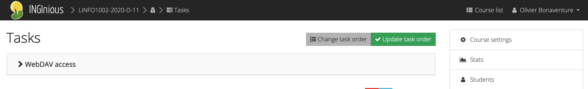

WebDAV est un protocole permettant d'accéder à un serveur de fichiers à travers le web. Son fonctionnement sort du cadre de ce projet, mais vous trouverez des informations complémentaires sur la page qui lui est consacrée sur wikipedia: `https://en.wikipedia.org/wiki/WebDAV <https://en.wikipedia.org/wiki/WebDAV>`_. INGInious vous génère un très long mot de passe unique qui vous permet d'accéder au serveur webdav.
            
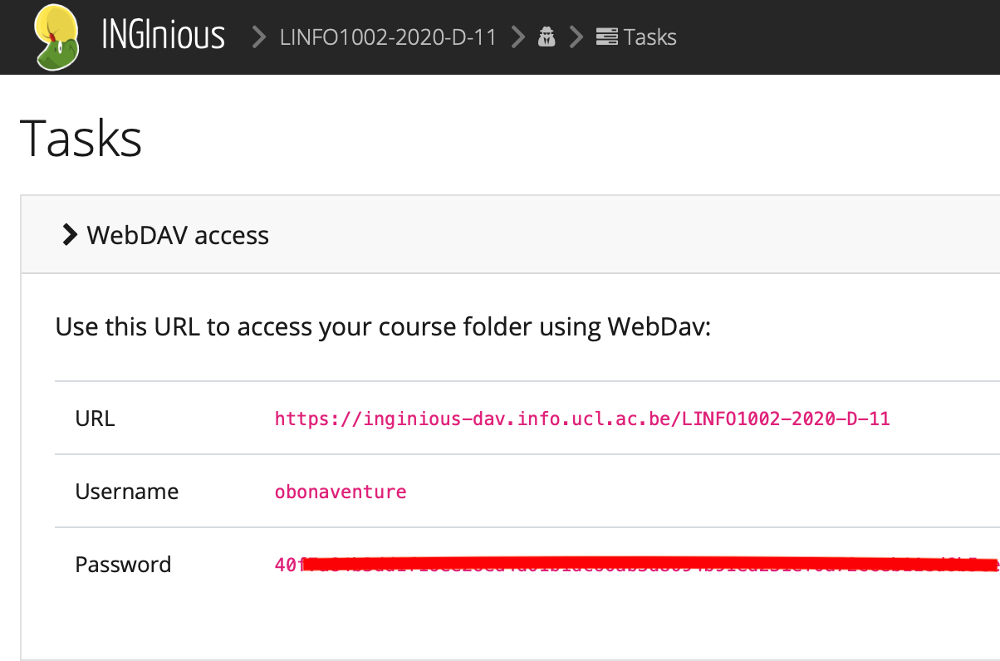

Vous trouverez sur Internet et notamment https://www.webdavsystem.com/server/access/ des informations sur l'utilisation de WebDAV sur votre système d'exploitation préféré.

Commençons par la création de l'énoncé via l'interface web. C'est la partie la plus simple de la création d'un exercice.

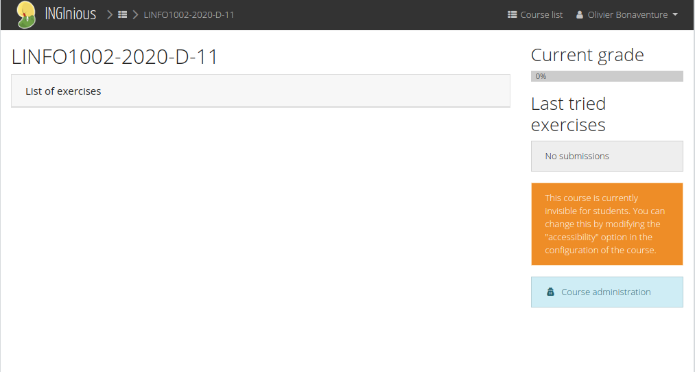

La première étape est de cliquer sur le bouton Course administration. INGInious affiche maintenant la page de gestion du cours qui contient de nombreuses informations sur les responsables du cours, sa disponibilité, des statistiques, etc. Sur la barre de droite, le bouton `Tasks` permet d'accéder aux différentes tâches associées au cours.   

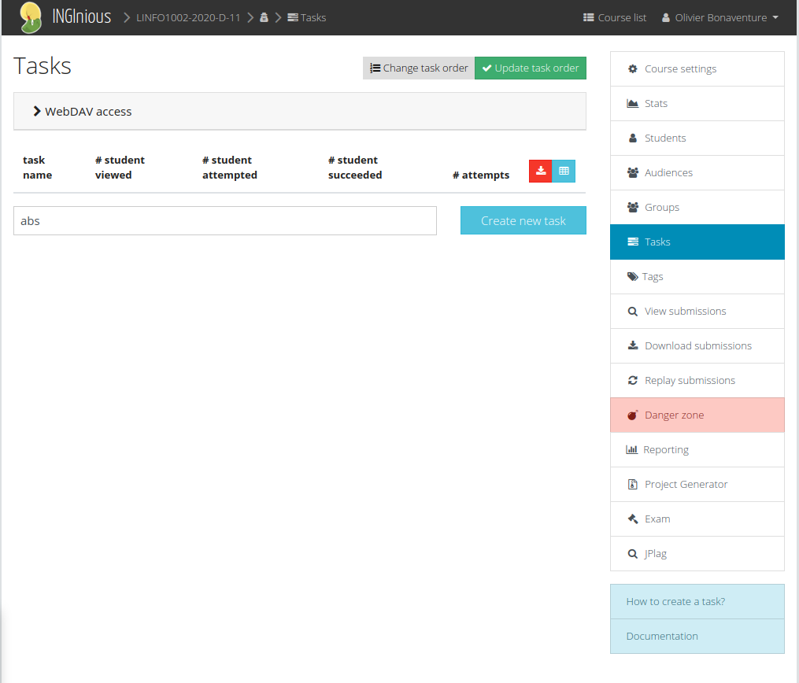

Pour ajouter une tâche, il suffit de taper son nom dans la boîte de dialogue et de cliquer sur ``Create new task``. INGInious affiche alors les informations de configuration pour une tâche. Il faut d'abord spécifier:

 - un titre résumant la tâche (champ ``Name``)
 - une brève explication sur la tâche (champ ``Context``)
 - l'auteur de la tâche (champ ``Author``)
 - un URL permettant de contacter l'auteur de la tâche en cas de problème. Cela peut être un URL ``mailto`` pour l'envoi d'un email ou un URL pointant vers un forum ou un formulaire de création d'issue sur GitHub ou autre
 - des catégories qui permettent de regrouper les tâches par domaine (nous ne les utiliserons pas)
 - le poids relatif de la question par rapport aux autres du même cours

Les autres informations ne nous concernent pas dans le cadre de ce projet et il est inutile de les modifier. N'oubliez pas de pousser sur ``Save changes`` quand vous avez fini de remplir ce formulaire.   

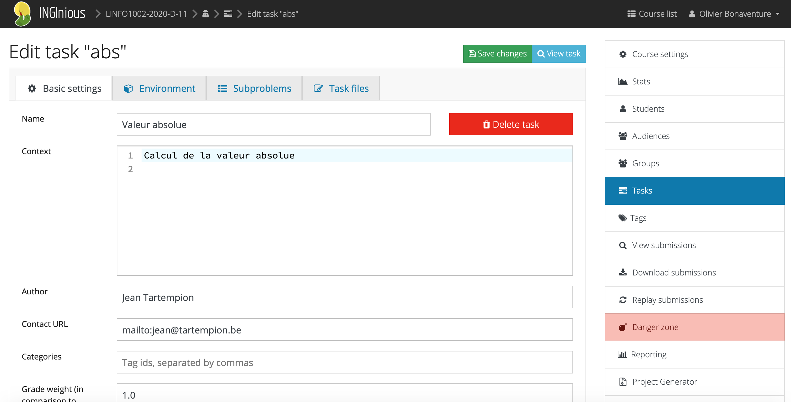

Il nous faut maintenant spécifier l'environnement logiciel qui va être utilisé pour vérifier l'exercice en cliquant sur le bouton ``Environment``. Vous devez sélectionner un ``Docker container`` et ``pyjavacpp`` comme ``Grading environment``. Les autres paramètres ne doivent pas être modifiés. Vous pouvez sauvegarder vos modifications via ``Save changes`` et ensuite définir vos exercices en cliquant sur ``Subproblems``.

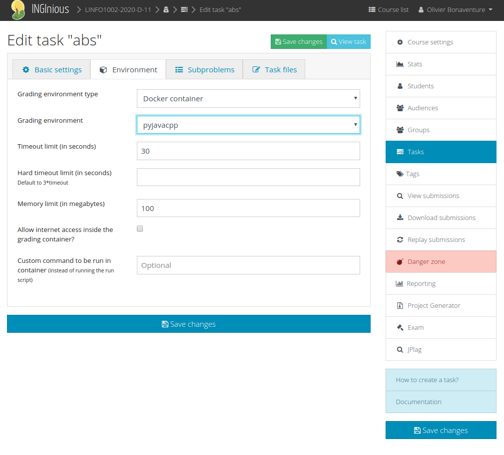

Commençons par créer une question baptisée ``q1`` et de type ``code`` en cliquant sur le bouton ``Add``. INGInious supporte d'autres types de questions, mais nous ne les utiliserons pas dans ce projet.

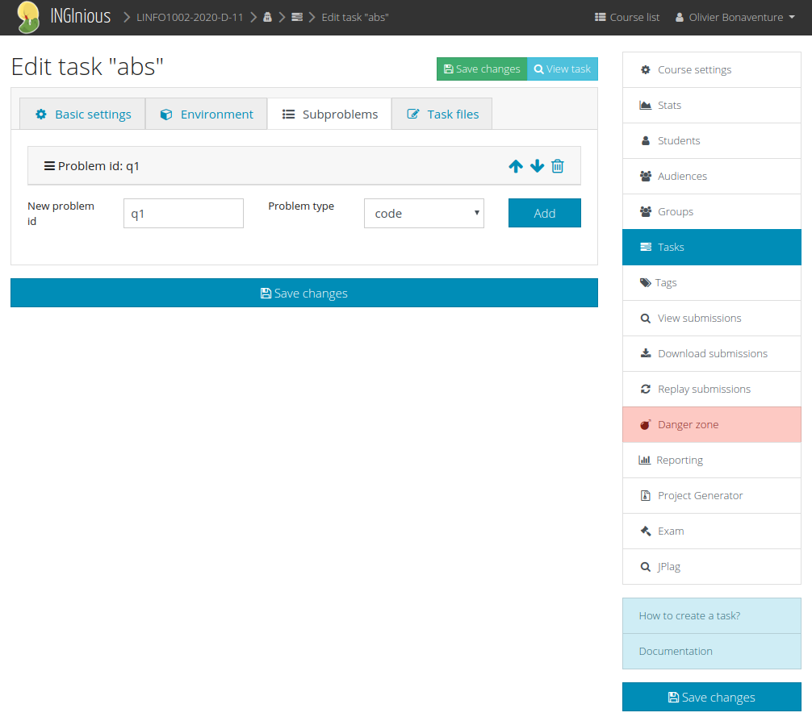
	    
Vous pouvez maintenant agrandir la zone de texte relative à la question ``q1``  et remplir les boîtes de dialogue ``Name`` et ``Context`` ainsi qu'indiquer que le langage Python est utilisé. Les autres champs ne doivent pas être modifiés.

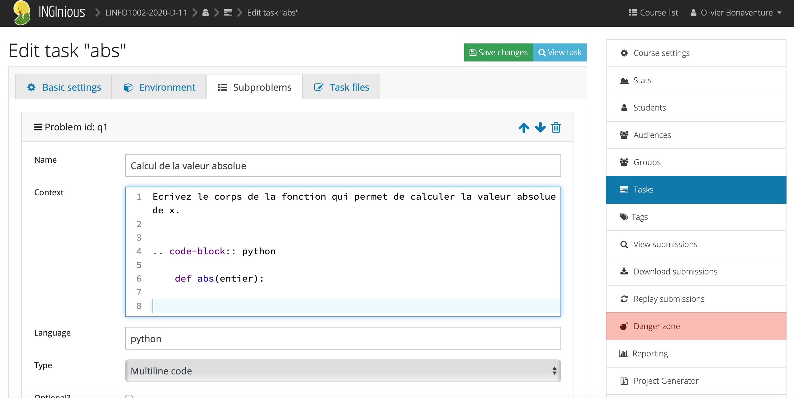

Vous pouvez maintenant créer les fichiers qui vont permettre de tester l'exercice INGInious. Pour cela, cliquez sur ``Task files`` pour visualiser et modifier les fichiers qui correspondent à cette tâche INGInious.

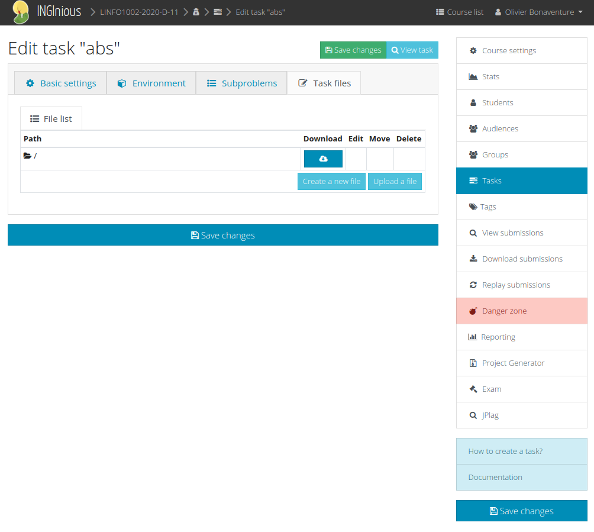

A ce stade, le répertoire INGInious correspondant à la tâche est vide. Nous allons le remplir en nous inspirant du repo GitHub `https://github.com/obonaventure/LINFO1002-P1 <https://github.com/obonaventure/LINFO1002-P1>`_

Par convention, un exercice INGInious aura la structure suivante:

 - un fichier :download:`run </python/inginious/run>` qui est exécuté par INGInious pour évaluer la tâche. Prenez le fichier disponible sur GitHub et ne le modifiez pas.
 - un répertoire ``src`` qui va contenir votre fonction correcte, votre suite de test et un répertoire nommé ``Templates`` qui est utilisé par le fichier ``run``.  
 - un répertoire ``test`` que nous utiliserons par après   

Commençons par créer le template :download:`src/Templates/abs </python/inginious/abs>` qui contient la définition de la fonction et éventuellement des ``import`` dont elle pourrait avoir besoin. Ce fichier doit se trouver dans le sous-répertoire ``Templates`` du répertoire ``src``.

.. literalinclude:: python/inginious/abs

Nous créons d'abord le fichier dans le répertoire racine.
                    
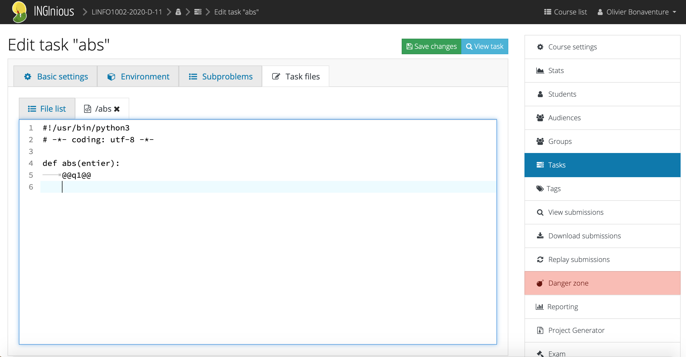

Ensuite il suffit de le déplacer vers ``src/Templates``.

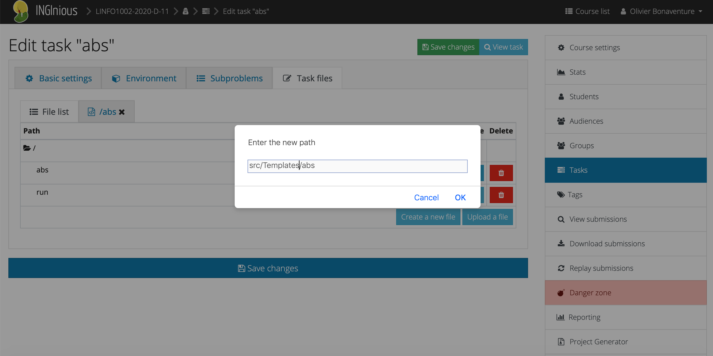
           
                    
Ce fichier contient le squelette dans lequel le code que l'étudiant tapera sur INGInious sera ajouté. Le symbole ``@   @q1@@`` est l'identifiant de la question, dans notre cas ``q1``. Il est possible d'intégrer plusieurs sous-questions dans le même template si nécessaire.

Ensuite nous pouvons créer une version correcte de la fonction demandée aux étudiants. Cette fonction est placée dans le fichier :download:`src/CorrAbs.py </python/inginious/CorrAbs.py>` qui se trouve dans le répertoire ``src``.

.. literalinclude:: python/inginious/CorrAbs.py
   :language: python

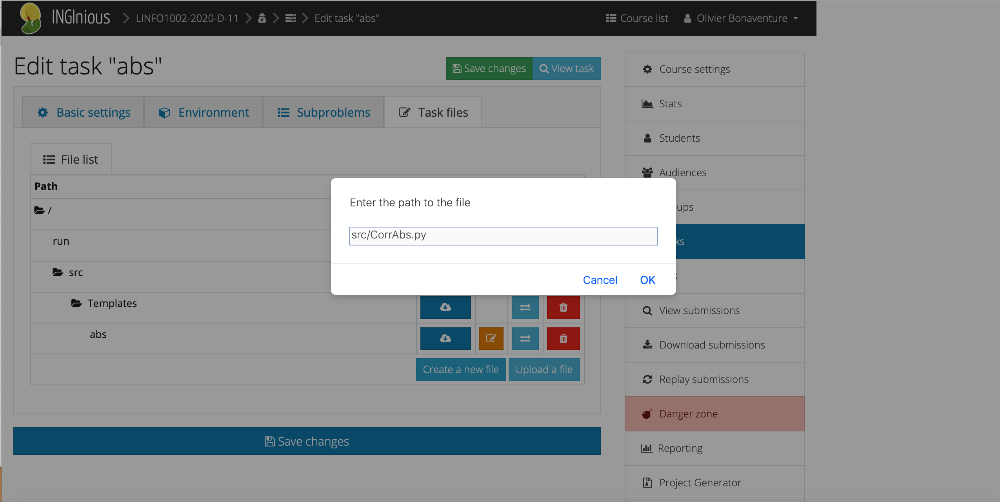

Il suffit maintenant de remplir ce fichier.
            
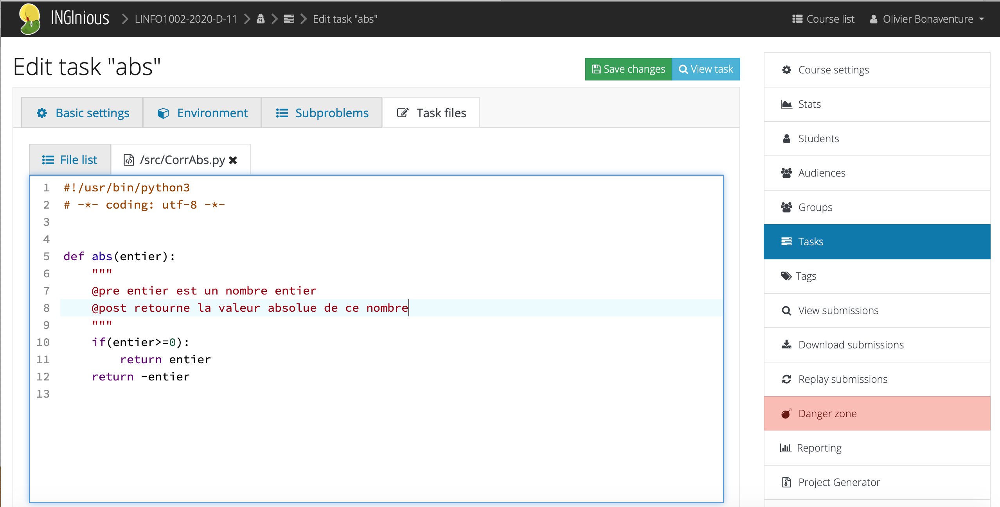

            
Nous pouvons enfin construire les tests unitaires. Ceux-ci se trouveront dans le fichier ``src/TestAbs.py`` que vous pouvez télécharger via :download:`src/TestAbs.py </python/inginious/TestAbs.py>`.

.. literalinclude:: python/inginious/TestAbs.py
   :language: python

Il y a quelques particularités à remarquer par rapport à la présentation générale des tests unitaires dans le chapitre précédent. Tout d'abord, nous importons deux versions de la fonction à tester :

 - la variable correcte en utilisant ``import CorrAbs as correct``
 - la solution de l'étudiant en utilisant ``import abs as student``

Ces deux importations nous permettent d'exécuter la fonction écrite par l'étudiant en appelant ``student.abs()`` et la version correcte via ``correct.abs()``.

Une deuxième différence importante avec les tests unitaires classiques est que vous ne pouvez pas faire d'hypothèse sur le code écrite par les étudiants. Il est très possible que celui-ci contiennent des erreurs qui vont provoquer une exception. Une façon simple est d'entourer l'appel à ``student.abs()`` avec un ``try: ... except:`` comme ci-dessous.

.. code-block:: python
                
            try:
                student_ans=student.abs(n)
            except: # capture toutes les exceptions possibles
                e = sys.exc_info()[0]
                self.fail("Votre fonction a provoqué l'exception "+
                         str(e)+" avec comme argument "+str(n))

Ce ``try: ... except:`` capture toutes les exceptions possibles. Vous pouvez bien entendu l'améliorer en fournissant aux étudiants un message d'erreur spécifique à l'exception provoquée par vos tests. Pour le calcul de la valeur absolue, le code des étudiants ne devrait normalement pas provoquer d'exception, mais d'autres types d'exercices le pourraient. 

.. commentaire ce serait bien de définir des tags pour couvrir ce genre de tags, mais c'est un peu trop tôt pour cette année, peut-être l'an prochain

   
Une troisième différence est que ``unittest`` exécute par défaut les tests dans l'ordre alphabétique du nom des méthodes de la classe ``TestAbs``. Si vous souhaitez que certains tests soient exécutés avant d'autres, choisissez intelligemment les noms de vos méthodes de test.              
              
Vous pouvez maintenant essayer votre premier exercice INGInious en Python et voir comment la suite de test réagit à vos erreurs. N'hésitez pas à modifier la suite de tests pour l'améliorer.

 
