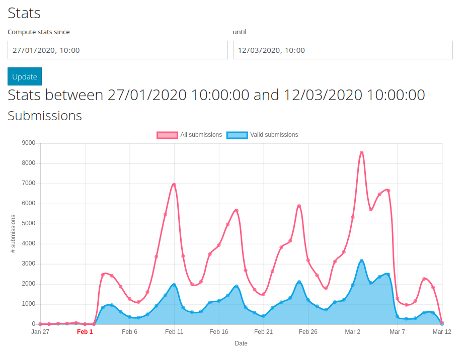
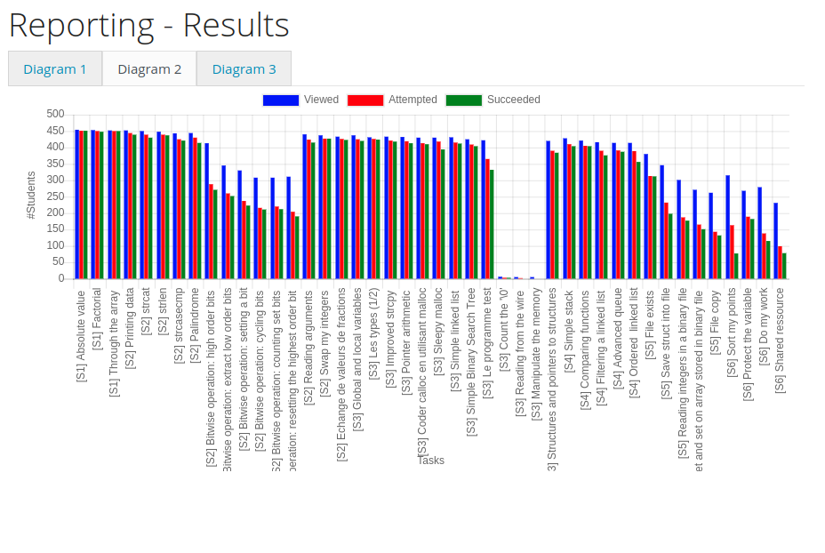

.. LINFO1002 documentation master file, created by
   sphinx-quickstart on Tue Jan 28 18:06:33 2020.
   You can adapt this file completely to your liking, but it should at least
   contain the root `toctree` directive.

Second projet: site web de visualisation
========================================

Durant le premier projet, vous avez proposé de nouveaux exercices en
python pour la plate-forme INGINIOUS. Sur la plate-forme INGINIOUS qui
est déployée à l'UCLouvain, des milliers d'étudiants soumettent chaque
semaines des dizaines de milliers de propositions de réponses à des
exercices de programmation. Durant l'année 2019, plus de trois mille
étudiants ont fait ensemble plus de 800.000 soumissions. INGINIOUS
intègre quelques visualisations qui permettent aux enseignants de
suivre la progression des étudiants dans leur cours.

La première de ces visualisations est accessible via l'onglet `Stats` de
INGINIOUS. Elle permet de visualiser le nombre de soumissions faites pour
un cours donné.

   Statistiques de base sur INGINIOUS	    

L'onglet `Reporting` fournit également quelques rapports sur les
résultats de différentes tâches.

   Un exemple de rapport fourni par INGINIOUS	    

La plupart des enseignants souhaitent disposer de rapports plus complets
qui intègrent une visualisation graphique. Même si il est écrit en
python et est disponible en open-source, une modification directe
du code source d'INGINIOUS sort du cadre de ce cours. Par contre, nous
vous demandons de préparer un prototype de visualisation des résultats
INGINIOUS.

Pour cela, une partie des données collectées l'an passé sur INGINIOUS
a été convertie
dans une base de données au format SQL. Cette base de données occupe
près de 100 MBytes tout en ne contenant que l'information relative
à trois cours disponibles sur la plate-forme.

Afin d'aider les enseignants qui utilisent INGINIOUS, votre objectif
est de concevoir et d'implémenter un site web interactif permettant de
visualiser de façon claire la progression et les résultats obtenus par
les étudiants. Ce faisant, vous aller devoir apprendre les concepts
suivants:

 - les bases du fonctionnement du world-wide web, voir :ref:`ref-web` 
 - les bases de l'HyperText Markup Langage (HTML) qui est utilisé pour écrire les pages disponibles sur un serveur web, voir :ref:`ref-html`
 - les bases pour utiliser la librairie ``chart.js`` pour produire facilement de belles visualisations, voir :ref:`ref-chartjs`
 - le framework flask qui permet d'implémenter facilement des sites web interactifs en python, voir :ref:`ref-flask`
 - les bases de SQL et la façon dont on peut interagir avec une base de données SQL en python, voir :ref:`ref-sql`

Vous veillerez, bien entendu, à écrire du code python clair, documenté et accompagné de tests unitaires. Une première version de votre projet devra être prête pour la fin du mois d'avril. Début mai, vous fournirez du feedback détaillé à d'autres groupes d'étudiants. Ensuite vous utiliserez le feedback reçu pour améliorer votre propre projet et présenterez votre prototype à l'équipe enseignante et un des développeurs d'INGINIOUS. 

