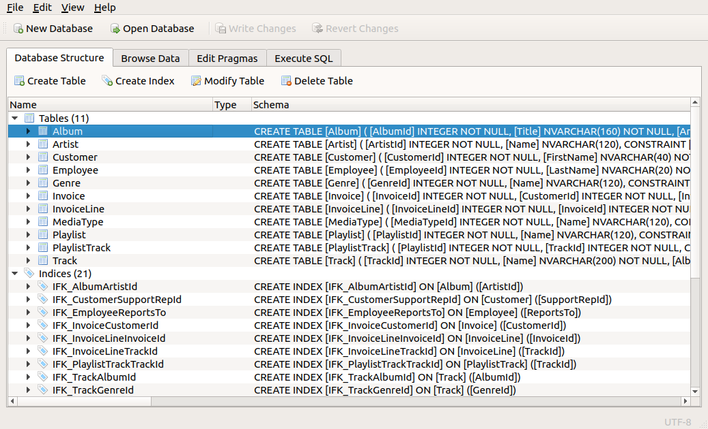
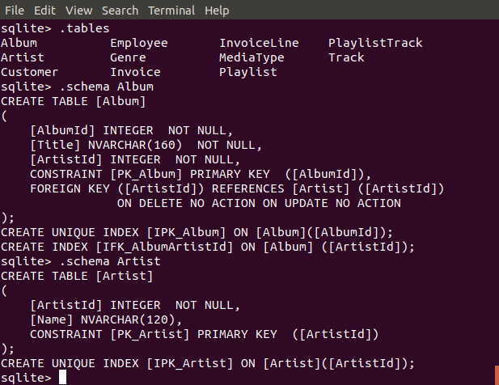

.. LINFO1002 documentation master file, created by
   sphinx-quickstart on Tue Jan 28 18:06:33 2020.
   You can adapt this file completely to your liking, but it should at least
   contain the root `toctree` directive.

.. _ref-sql:
   
Les bases de données SQL
========================

Quand on doit traiter de petits volumes de données, on peut se contenter
de les stocker dans des fichiers et d'y accéder directement depuis
des programmes écrits en Python. Cette approche est simple et peut
donner de bons résultats pour de petits volumes de données ou des
données sur lesquelles on doit faire des opérations simples et
qu'il ne faut pas souvent modifier. Dans tous les autres cas, il est préférable
de faire appel à des gestionnaires de bases de données qui ont été optimisés
au fil des années pour stocker et manipuler efficacement de grandes
quantités de données.

Aujourd'hui, les bases de données les plus populaires sont les bases
de données qui sont dites relationnelles. Une telle base de données est
composée d'une ou plusieurs *tables* qui contiennent de l'information. Chaque
table est composée d'un ensemble de lignes qu'on appelle souvent des records.
L'information dans une table est aussi divisée en colonnes, chacune de
ces colonnes correspondant à un champ ou attribut qui est présent dans chaque
record. Une telle base de données est dite relationnelle car il est possible de
lier entre eux les lignes qui se trouvent dans des tables différents.

.. spelling::

   Structured
   Query
   Language
   Android
   Windows
   iOS
   iTunes
   Binary
   OBject

Dans ce document, nous nous focaliserons sur les bases de données utilisant
le Structured Query Language (SQL), un langage standardisé supporté par
défaut vendeurs de base de données. Pour le projet, nous utiliserons
`SQLite <https://sqlite.org>`_ qui est une implémentation efficace de SQL qui
supporte de petites bases de données. SQLite a l'avantage d'être très bien
supporté par le langage Python. SQLite est intégré dans les logiciels suivants : Android, iOS, MacOS, Windows10, Firefox, Chrome, Safari, iTunes, Dropbox, ...

Une table
---------

Les tables constituent le coeur d'une base de données. Chaque table d'une base
de données est composée de colonnes et chaque colonne contient de
l'information d'un type particulier, comme un nombre, un caractère, une
data, une chaîne de caractères, ... Une ligne de la table contient une valeur
pour chaque colonne.

SQL permet de stocker différents types d'information dans une table. SQLite
supporte les types suivants:

 - ``INTEGER`` : un nombre entier
 - ``REAL`` : un nombre réel
 - ``TEXT`` : une chaîne de caractères
 - ``BLOB``: un séquence de bytes (Binary Large OBject)
 - ``NULL`` : indique l'absence d'une valeur

SQLite peut aussi stocker des dates et des heures en les représentant sous la
forme d'un ``TEXT``, un ``REAL`` ou un ``INTEGER``. Des fonctions spécifiques
permettent de manipuler ces dates et heures.

La base de données ci-dessous est composée de quatre colonnes. La première
contient des nombres entiers tandis que les trois autres contiennent
des chaînes de caractères. Lorsque l'on crée une telle table dans une
base de données, il est souvent nécessaire de spécifier la taille de
chacun des champs qui est stocké. Ici, on aura par exemple réservé 30
caractères pour le nom et le prénom et 50 pour l'adresse email. La colonne
matricule ne peut contenir que des nombres entiers.

+------------+------------+-----------+--------------------------+
| matricule  | nom        | prénom    | email                    |
+------------+------------+-----------+--------------------------+
| 17         | Durand     | Jules     | jules.durand@gmail.com   |
+------------+------------+-----------+--------------------------+
| 42         | Tartempion | Emilie    | et@hotmail.com           |
+------------+------------+-----------+--------------------------+
| 95         | Durant     | Antoine   | durant@hotmail.com       |
+------------+------------+-----------+--------------------------+

.. spelling::

   Durand
   Tartempion
   Durant
   Jules
   Emilie
   Antoine

Lorsque l'on conçoit une base de données, on en définit son schéma,
c'est-à-dire la structure de chacune des tables et les liens qui existent
entre ces tables. Pour pouvoir faire des liens entre des tables, il est
important de pouvoir identifier une ligne d'une table de façon unique.
Dans la table des étudiants présentée ci-dessous, cela peut se
faire en utilisant le matricule ou l'adresse email de l'étudiant. Cet
identifiant unique est appelé une *clé primaire* (`primary key` en anglais).
Cette clé peut être une colonne de la table ou dans certains cas un groupe
de colonnes de la table. Dans la table ci-dessus, les noms et prénoms
des étudiants ne sont pas de bonnes clés primaires puisque rien ne
garantir leur unicité.

Cette clé primaire peut servir de lien vers une autre table. Considérons une
table qui reprend les inscriptions à un programme universitaire. Celle-ci
pourrait être structurée comme suit:

+------------+------------+-----------+
| programme  | étudiant   | année     |
+------------+------------+-----------+
| SINF1BA    | 17         | 2         |
+------------+------------+-----------+
| SINF11     | 33         | 1         |
+------------+------------+-----------+
| SINF1BA    | 42         | 3         |
+------------+------------+-----------+

Dans ce cas, le matricule de la première table sert de clé externe
(`foreign key` en anglais) dans la seconde table. Des relations plus
complexes peuvent être créées entre les différentes tables d'une
base de données. Le principe de base lors de la création d'un schéma
de base de données est d'encoder une information à un seul endroit dans
la base de données et d'utiliser des clés externes pour faire référence à la
table contenant l'information mère. Les règles de création d'un
base de données sortent du cadre de ce projet et seront abordées
dans le cadre du cours de bases de données.

.. spelling::

   tutoriel
   téléchargée

Utilisation de SQL depuis Python
--------------------------------

SQL est un langage standardisé qui est supporté par de nombreuses bases
de données et de nombreux langages de programmation. Il y a de nombreuses
façons d'accéder à une base de données en SQL. Dans le cadre de ce
tutoriel, nous utiliserons la base de données d'exemple baptisée Chinook
qui est notamment utilisée par le site `https://sqlitetutorial.net <https://sqlitetutorial.net>`_. 

Cette base de données peut être téléchargée depuis : `https://github.com/lerocha/chinook-database/raw/master/ChinookDatabase/DataSources/Chinook_Sqlite.sqlite <https://github.com/lerocha/chinook-database/raw/master/ChinookDatabase/DataSources/Chinook_Sqlite.sqlite>`_

Une première façon d'explorer son contenu est d'utiliser un logiciel disposant d'une interface graphique tel que `sqlitebrowser <https://sqlitebrowser.org/>`_.

   Utilisation de sqlitebrowser sur la base de données Chinook

Un outil tel que `sqlitebrowser <https://sqlitebrowser.org/>`_ est intéressant
pour sa balader dans une nouvelle base de données ou modifier son contenu, mais
c'est nettement moins flexible que d'écrire un programme pour l'interroger.
   
   
Il est aussi possible d'accéder à la base de données depuis l'interface
en ligne de commande de sqlite.

   Utilisation de sqlite en ligne de commande

La commande ``.tables`` permet de lister les tables se trouvant dans la
base de données. La base de données Chinook contient notamment
de l'information relative à des albums musicaux. Celle-ci est structurée
dans plusieurs tables. La commande ``.schema`` permet de voir les commandes
qui ont été utilisées pour créer cette table de la base de données. Nous
reviendrons sur les principales commandes de SQL en nous concentrant sur
celles qui permettent d'extraire des données.

.. spelling::

   package
   sqlite

   
Connexion à une base de données SQL
...................................

SQLite est directement inclus dans la distribution de Python. Vous pouvez
donc l'utiliser en important simplement le package ``sqlite3`` dans
vos programmes Python. La première étape pour utiliser une base
de données est de s'y connecter. Dans une entreprise, cela peut nécessiter
de connaître le nom du serveur sur laquelle elle tourne et d'obtenir des
informations telles qu'un nom d'utilisateur ou un mot de passe. Comme SQLite
utilise un fichier unique sur l'ordinateur pour stocker la base de données,
il suffit de spécifier le nom de ce fichier pour y accéder via la
fonction ``sqlite3.connect``. Cette fonction retourne un objet ``Connection``
qui permet d'interagir avec la base de données. L'envoi de commandes SQL
se fait en utilisant un objet ``Cursor`` qui est obtenu grâce à la méthode
``cursor()``. C'est via cet objet que toutes les interactions avec la
base de données se feront depuis le programme Python. Lorsque le programme
a fini d'utiliser la base de données, il doit fermer la connexion
avec la méthode ``close()``. Si celle-ci a été modifiée, il faut penser
à faire appel à ``commit()`` pour forcer l'écriture des modifications.

.. literalinclude:: sql/db.py 
   :language: python

	      

Création d'une base de données SQL
..................................

La première étape est de créer une base de données. Commençons par une
base de données comprenant une seule table. Notre base de données
va stocker les élèves d'une classe. Elle contient les informations suivantes:

 - Nom de l'élève (chaîne de caractères)
 - Prénom de l'élève (chaîne de caractères)
 - Année de naissance (nombre entier)
 - Moyenne des points (nombre réel)
 - Matricule (entier)

La clé primaire de cette table est le matricule qui est unique pour
chaque élève. La table peut être créée par la commande suivante :

.. literalinclude:: sql/db-create.py 
   :language: python
   :start-after: #start
   :end-before: #end

Dans ce schéma, on indique que les champs ``MATRICULE``, ``NOM``, ``PRENOM``,
et ``AGE`` sont obligatoires en spécifiant qu'ils ne peuvent pas avoir la valeur
``NULL``. Le moteur de base de données vérifiera que cette contrainte est
respectée lors de toute modification de la base de données. 

Ajout d'information dans une base de données SQL
................................................

La table étant créée, nous pouvons maintenant y ajouter de l'information.
Cela se fait en utilisant la commande SQL ``INSERT INTO`` qui prend
comme arguments un nom de table, une liste d'identifiants de colonnes, et
une liste de valeurs précédée du mot-clé ``VALUES``.

La première façon d'insérer des données dans une table SQL est de
fournir la commande avec toutes les données à insérer comme dans l'exemple
ci-dessous.

.. literalinclude:: sql/db-insert2.py 
   :language: python
   :start-after: #s1
   :end-before: #e1

Lorsque l'on doit insérer plusieurs données dans la table, par exemple le
contenu d'une liste Python ou d'un dictionnaire, il est plus facile
d'utiliser des espaces réservés qui sont identifiés dans la commande
par le caractère ``?``. La librairie `sqlite3` remplace ces espaces réservés
par les valeurs se trouvant dans la liste passée en argument.

		
.. literalinclude:: sql/db-insert2.py 
   :language: python
   :start-after: #s2
   :end-before: #e2

On peut faire de même avec un dictionnaire et indiquer dans la chaîne de
caractères qui contient la commande SQL des noms de clés et passer en second
argument un dictionnaire définissant un valeur pour chacune de ces clés. Dans
la commande SQL, chaque clé est précédée du caractère `:`. Cette forme peut
être utile lorsqu'il faut insérer le contenu d'un dictionnaire dans une table
SQL.

.. literalinclude:: sql/db-insert2.py 
   :language: python
   :start-after: #s3
   :end-before: #e3

Lorsque `sqlite3` traite une commande d'insertion, la librairie vérifie
que les contraintes spécifiées à la création de la table sont respectées.
Ces contraintes peuvent porter sur la présence de valeurs nulles, la
taille des chaînes de caractères, etc. L'exemple ci-dessous montre une
insertion d'un record qui ne contient pas de valeur pour le champ ``POINTS``.
Cette insertion est acceptée puisqu'elle est conforme à la définition
de la table ``CLASSE``.
		
.. literalinclude:: sql/db-insert2.py 
   :language: python
   :start-after: #s4
   :end-before: #e4

Par contre, il n'est pas possible d'insérer dans la base de données un record
qui ne contient pas de valeur pour le champ ``AGE``.
				
.. literalinclude:: sql/db-insert2.py 
   :language: python
   :start-after: #s4
   :end-before: #e4

Recherche d'information dans une base de données SQL
....................................................

Dans le cadre de ce projet, vous vous concentrerez sur l'extraction
d'information se trouvant dans une base de données existante, mais vous ne
la modifierez normalement pas. En SQL, l'extraction d'information se fait
en utilisant la requête ``SELECT``. La forme générique d'une requête
``SELECT`` est ``SELECT <liste de colonnes> FROM <table> WHERE <conditions>``
où ``<liste de colonnes>`` est une liste d'identifiant de colonnes,
``<table>`` le nom d'une table et ``<conditions>`` une série de conditions
qui permettent de sélectionner les données à extraire.

La forme la plus simple de la requête est de ne pas écrire de condition.

.. literalinclude:: sql/db-select1.py 
   :language: python
   :start-after: #start
   :end-before: #end

Ce code affiche sur sa sortie standard les étudiants de la classe.

.. code-block:: console

   Prénom	 Nom
   Emilie 	 Durant
   Joséphine 	 Durand
   Jean 	 Tartempion
   Jules 	 Dupont

Plutôt que de spécifier les colonnes qui sont demandées, il est aussi possible
d'obtenir une copie du contenu de toute la table en utilisant ``*`` comme
identifiant de colonnes.

.. literalinclude:: sql/db-select1.py 
   :language: python
   :start-after: #s1
   :end-before: #e1

		
Ce code retourne la liste des attributs contenus dans la table ``CLASSE``.

.. code-block:: console

   (1, 'Durant', 'Emilie', 8, 73.5)
   (2, 'Durand', 'Joséphine', 7, 88.65)
   (4, 'Tartempion', 'Jean', 9, 68.65)
   (12, 'Dupont', 'Jules', 9, None)

En utilisant les conditions de la requête ``SELECT``, il est possible de
filtrer les données avant de les extraire. SQL supporte de nombreux filtres.
Il est tout d'abord possible de comparer la valeur d'un champ de la
base de données. Les comparaisons suivantes sont supportées :

 - ``=`` : égal
 - ``<>`` : différent
 - ``>`` : plus grand que (ainsi que ``>=``)
 - ``<`` : plus petit que (ainsi que ``<=``)

A titre d'exemple, le code ci-dessous permet d'extraire les étudiants
qui ont une moyenne supérieure à 70.
		
.. literalinclude:: sql/db-select1.py 
   :language: python
   :start-after: #s2
   :end-before: #e2

Plusieurs conditions peuvent être combinées sous la forme d'une expression
booléenne en utilisant les opérateurs ``AND``, ``OR`` et ``NOT`` habituels.
		
Parfois, une requête SQL retourne de nombreux résultats identiques. Supposons
que l'on cherche à savoir les différents âges des étudiants de la classe
sans avoir besoin de connaître le nombre d'étudiants ayant chaque âge.

.. literalinclude:: sql/db-select1.py 
   :language: python
   :start-after: #s3
   :end-before: #e3

Cette requête extrait tous les âges (différents de NULL) de notre table.
Dans une grande base de données, cette liste peut être fort longue.
		
.. code-block:: console

   (8,)
   (7,)
   (9,)
   (9,)

Une meilleure approche est d'indiquer dans la requête SQL que l'on
souhaite juste obtenir les valeurs distinctes.

.. literalinclude:: sql/db-select1.py 
   :language: python
   :start-after: #s4
   :end-before: #e4

SQL supporte des conditions plus complexes. Il est notamment possible
de rechercher si un champ est ``NULL``. La requête ci-dessous va
extraire de notre table le record dont le champ ``POINTS`` est NULL
et afficher ``('Dupont', 12)``.

.. literalinclude:: sql/db-select1.py 
   :language: python
   :start-after: #s5
   :end-before: #e5

Les conditions d'une requête SQL peuvent aussi porter sur le contenu
des chaînes de caractères. L'approche est assez simple comparée aux
expressions régulières que l'on retrouve dans Python, mais elle permet
déjà de faire une pré-traitement de certaines données. Dans la chaîne
de caractères d'une condition, le caractère spécial ``_`` correspond à n'importe
quel caractère tandis que le caractère ``%`` peut remplacer n'importe quelle
suite de caractères. Les requêtes ci-dessous permettent d'extraire de la base
de données les élèves dont le nom de famille contient certains caractères.

.. literalinclude:: sql/db-select1.py 
   :language: python
   :start-after: #s6
   :end-before: #e6

Résultat affiché par ce code.

.. code-block:: console

   Requête : Du%
   ('Durant', 'Emilie')
   ('Durand', 'Joséphine')
   ('Dupont', 'Jules')
   Requête : Du%t
   ('Durant', 'Emilie')
   ('Dupont', 'Jules')
   Requête : D_____t
   ('Durant', 'Emilie')
   ('Dupont', 'Jules')

Le langage SQL contient de nombreuses fonctions que l'on peut utiliser dans
une requête SQL. Tout d'abord, il est possible appliquer les opérations
arithmétiques classiques (``+``, ``-``, ``*`` et ``/``) aux valeurs ou
variables numériques.

.. literalinclude:: sql/db-select1.py 
   :language: python
   :start-after: #s7
   :end-before: #e7

Cette requête affiche la sortie suivante :

.. code-block:: console

   ('Durant', 83.5)
   ('Durand', 98.65)
   ('Tartempion', 78.65)
   ('Dupont', None)

SQL supporte également des `fonctions <https://sqlite.org/lang_corefunc.html>`_
qui permettent de manipuler les chaînes de caractères comme dans n'importe
quel autre langage de programmation. Par exemple :

 - ``length(X)`` qui retourne la longueur de la chaîne de caractères ``X``
 - ``instr(X,Y)`` qui retourne la première occurrence de la chaîne ``Y`` dans ``X``

 - ``lower(X)`` qui transforme ``X`` en minuscules (voir aussi ``upper(X)``)
 - ``substr(X,Y,Z)`` qui retourne la sous-chaîne de caractères de ``X`` qui démarre au caractère ``Y`` et es longue de ``Z`` caractères
 - ``trim(X,Y)`` qui retire du début et de la fin de la chaîne ``X`` tous les caractères qui se trouvent dans la chaîne ``Y``

Les autres fonctions sont décrites dans le manuel de SQLite: `https://sqlite.org/lang.html <https://sqlite.org/lang.html>`_

SQLite support également des fonctions spécifiques à la manipulation des dates. Celles-ci sont décrites dans le manuel de SQLIte: `https://sqlite.org/lang_datefunc.html <https://sqlite.org/lang_datefunc.html>`_

Parmi les fonctions supportées par SQLite, les `fonctions d'agrégation <https://sqlite.org/lang_aggfunc.html>`_ sont particulières car elles permettent de
réaliser des calculs sur les résultats d'une requête. Voici quelques exemples
qui illustrent leur utilisation. Elles sont décrites dans le manuel
de SQLite: `https://sqlite.org/lang_aggfunc.html <https://sqlite.org/lang_aggfunc.html>`_.

.. literalinclude:: sql/db-select1.py 
   :language: python
   :start-after: #s8
   :end-before: #e8

Lorsque l'on manipule une base de données, il est parfois nécessaire de
connaître le nombre de fois qu'une valeur distincte est présente dans la base
de données, sans nécessairement devoir charger toutes ces valeurs. Cela
peut se faire en utilisant le modifier ``DISTINCT``. L'exemple ci-dessous
affiche ``(4, )`` ce qui indique qu'il y a quatre noms distincts dans notre
table d'exemple.

.. literalinclude:: sql/db-select1.py 
   :language: python
   :start-after: #s9
   :end-before: #e9

